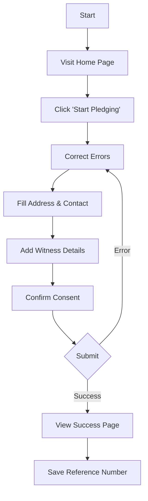
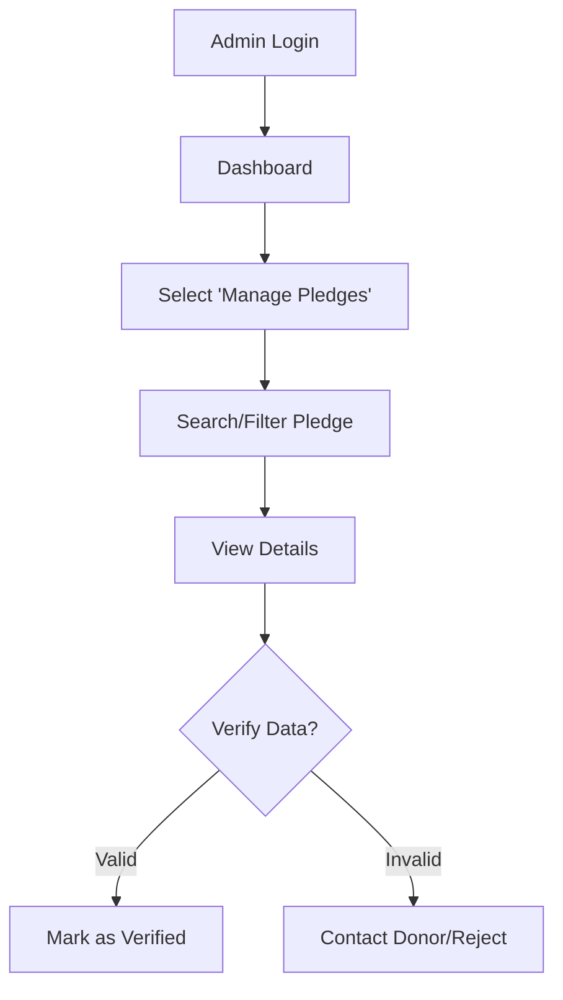

# User Manual

Welcome to the **Eye Donation Pledge** application user manual. This guide provides step-by-step instructions for both donors and administrators.

## Table of Contents
1. [Introduction](#introduction)
2. [Process Flows](#process-flows)
3. [Donor Guide](#donor-guide)
   - [Home Page](#1-home-page)
   - [Pledge Form](#2-pledge-form)
4. [Administrator Guide](#administrator-guide)
   - [Admin Login](#1-admin-login)
   - [Dashboard](#2-admin-dashboard)
   - [Pledge Management](#3-pledge-management)

---

## Introduction

The Eye Donation Pledge System allows citizens to pledge their eyes for donation after death. It provides a simple, secure interface for donors and a powerful management dashboard for the Eye Bank administrators.

---

## Process Flows

### Pledge Submission Flow (Donor)

### Pledge Verification Flow (Admin)

---

## Donor Guide

### 1. Home Page
The landing page provides an overview of the importance of eye donation and the current number of pledges.

**Actions:**
- Click **Start Pledging** to begin the donation process.
- Read "Why Donate?" to understand the impact.

### 2. Pledge Form
This is the core of the application. It captures all necessary legal and medical information.

**Key Fields:**
- **Donor Details**: Name, Age, Gender, Blood Group.
- **ID Proof**: Aadhaar, PAN, etc. (Required for verification).
- **Address**: Current residential address.
- **Witness**: One witness is mandatory (preferably next of kin).
- **Consent**: You must explicitly agree to the pledge terms.

**Note**: All fields marked with `*` are mandatory.

---

## Administrator Guide

### 1. Admin Login
Secure entry point for authorized personnel.

**Credentials**:
- Use your assigned username and password.
- If you forget your password, contact the system administrator.

### 2. Admin Dashboard
The command center for the Eye Bank operations.

**Features:**
- **Statistics Cards**: Immediate view of Total Pledges.
- **Graphs**: Visual representation of pledges by State and Month.
- **Quick Links**: Fast access to common tasks.

### 3. Pledge Management
View and manage the list of all pledges.

**Capabilities:**
- **Search**: Find a donor by Name, Mobile, or Reference Number.
- **Filter**: Narrow down by "Verified/Unverified" or State.
- **View**: Click "View" to see the full details of a specific pledge.
- **Export**: Download the current list as a CSV file for reporting.
